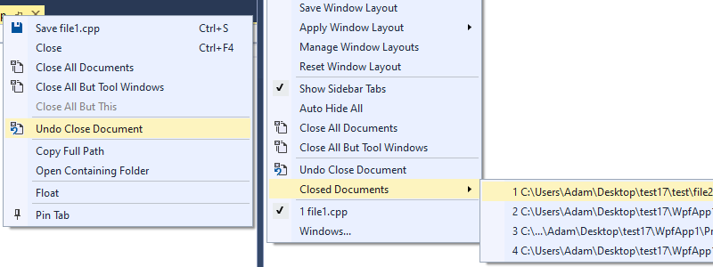

# Undo Close Document
## extension for Visual Studio 2013, 2015, 2017 and 2019

This extension allows to reopen recently closed document tab.

1. **Right-click** one of the opened tabs or go to menu **Window**
2. Choose **Undo Close Document**

Keyboard shortcut can be set in **Options->Environment->Keyboard** command **Window.UndoCloseDocument**.

Maximum numbers of documents remembered and shown on the list can be set in **Options->Undo Close Document->General**.

This extension has to be autoloaded with Visual Studio to work properly. It supports Visual Studio as old as 2013 which means it's loaded synchroniously. In Visual Studio 2019 synchronious autoloading is disabled by default. If you want to use this extension with Visual Studio 2019 you have to **Allow synchronous autoload of extensions** in **Options->Environment->Extensions**.

You can download this extension from [Visual Studio Marketplace](https://marketplace.visualstudio.com/items?itemName=AdamWulkiewicz.UndoCloseDocument) or [GitHub](https://github.com/awulkiew/undo-close-document/releases).
